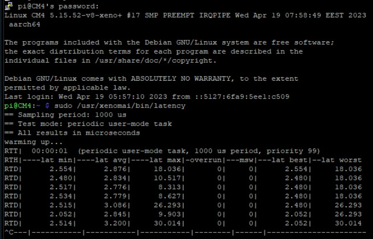

#### Step by step guide on how to experience the glory of Xenomai on your rPi

# Table of contents
1. [A new beginning - Prerequisites](chapter_0.md)
2. [What about dependencies?](chapter_1.md)
3. [A manual journey - patch the kernel with Cobalt](chapter_2.md)
4. [Are we there yet? Install xenomai on rPi](chapter_3.md)

#### These steps were tested on a Raspberry Pi Compute module 4 and eventually Xenomai and Cobalt were running on this hardware.

