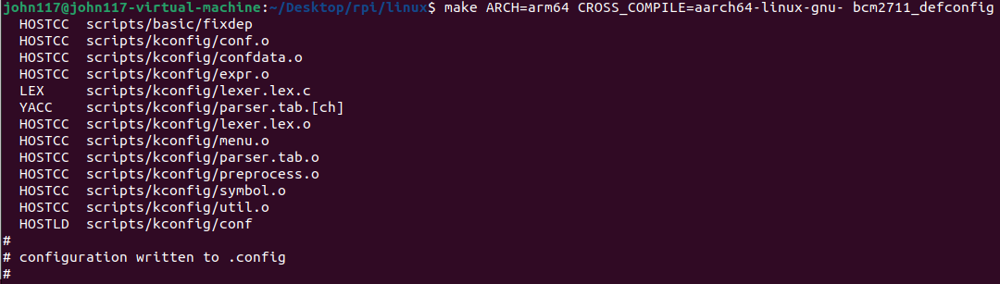
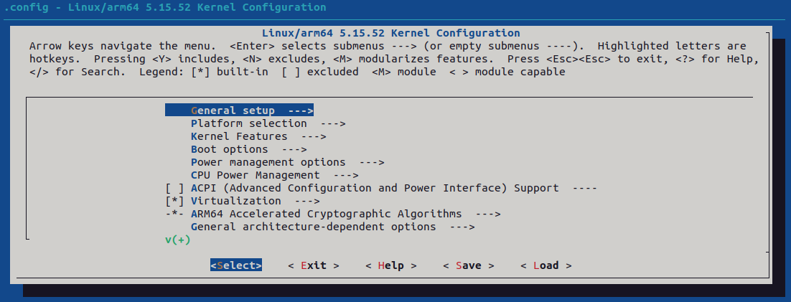
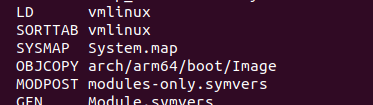
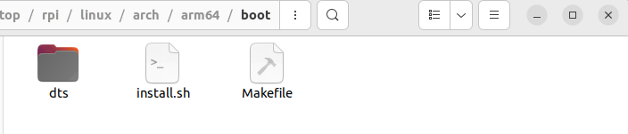
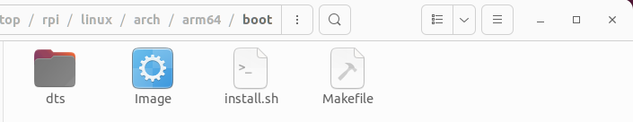
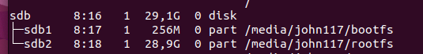
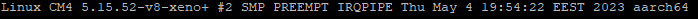

## 1. Linux
### 1.1. Clone the rPi 5.15 branch of Linux
```
git clone --branch rpi-5.15.y https://github.com/raspberrypi/linux
```

### 1.2. Checkout 5.15.51(close/same as dovetail patch)
```
cd linux
```
```
git checkout 2a4746398db05d1d71e00c8f2cccdb85b2d3ca3c 
```
```
cd ..
```

## 2. Xenomai

### 2.1 Download Xenomai v3.2.1

```
wget https://source.denx.de/Xenomai/xenomai/-/archive/v3.2.1/xenomai-v3.2.1.tar.bz2
```
```
tar xjvf xenomai-v3.2.1.tar.bz2
```

### 2.2 Download Dovetail v5.15.51 patch

```
wget https://xenomai.org/downloads/dovetail/patch-5.15.51-dovetail1.patch.bz2
```
```
bzip2 -d patch-5.15.51-dovetail1.patch.bz2
```

## 3. Patch the linux source code
```
cd linux/
```
```
patch -p1 < ../patch-5.15.51-dovetail1.patch  2>&1 | tee patch_log.txt
```

## 4. Fix the files where the patch did not apply
Full log: [patch_log.txt](assets/files/2/patch_log.txt)

```
Hunk #7 FAILED at 177.
1 out of 7 hunks FAILED -- saving rejects to file arch/arm/include/asm/irqflags.h.rej
```
```
Hunk #1 succeeded at 30 (offset 1 line).
Hunk #2 succeeded at 666 (offset 230 lines).
Hunk #3 FAILED at 458.
Hunk #4 succeeded at 709 (offset 238 lines).
Hunk #5 succeeded at 717 (offset 238 lines).
Hunk #6 FAILED at 489.
Hunk #7 succeeded at 821 (offset 238 lines).
Hunk #8 succeeded at 850 (offset 246 lines).
Hunk #9 succeeded at 860 (offset 246 lines).
Hunk #10 succeeded at 933 (offset 248 lines).
Hunk #11 succeeded at 1017 (offset 258 lines).
Hunk #12 succeeded at 1116 (offset 267 lines).
Hunk #13 succeeded at 1126 (offset 267 lines).
Hunk #14 succeeded at 1307 (offset 337 lines).
Hunk #15 FAILED at 1042.
3 out of 15 hunks FAILED -- saving rejects to file drivers/dma/bcm2835-dma.c.rej
```
```
Hunk #1 FAILED at 102.
1 out of 1 hunk FAILED -- saving rejects to file drivers/irqchip/irq-bcm2835.c.rej
```

```
Hunk #1 FAILED at 1041.
Hunk #2 succeeded at 1080 (offset 14 lines).
Hunk #3 succeeded at 1346 (offset 14 lines).
Hunk #4 succeeded at 1429 (offset 14 lines).
1 out of 4 hunks FAILED -- saving rejects to file drivers/spi/spi-bcm2835.c.rej
```

#### Fixed files (no guarantees)

[./arch/arm/include/asm/irqflags.h](assets/files/2/irqflags.h)

[./drivers/dma/bcm2835-dma.c](assets/files/2/bcm2835-dma.c)

[./drivers/irqchip/irq-bcm2835.c](assets/files/2/irq-bcm2835.c)

[./drivers/spi/spi-bcm2835.c](assets/files/2/spi-bcm2835.c)

[files.zip](assets/files/2/files.zip)

## 5. Prepare kernel with xenomai
```
../xenomai-v3.2.1/scripts/prepare-kernel.sh  --arch=arm64 --linux=./
```

No log is displayed

## 6. Build Config
#### Configs rPi 4/400/CM4:
```
KERNEL=kernel8
```
```
make ARCH=arm64 CROSS_COMPILE=aarch64-linux-gnu- bcm2711_defconfig
```


```
make ARCH=arm64 CROSS_COMPILE=aarch64-linux-gnu- menuconfig
```



Edit the kernel config in menuconfig (minimal setup) and **Save**
```
Kernel features —> Timer frequency 1000Hz
General setup —> (-v7l-xeno3) Local version - append to kernel release
```

**Uncheck the following settings:**

```
CPU powermanagement –> CPU Frequency scaling –> [] CPU Frequency scaling
CPU powermanagement –> CPU idle PM support []
MemoryManagament options -> [] Allow for memory compaction
Kernel hacking -> Generic Kernel Debugging Instruments -> KGDB: kernel debugger[]
```

### 7. Build the kernel
```
make ARCH=arm64 CROSS_COMPILE=aarch64-linux-gnu- Image modules dtbs -j 24
```
Note: If you dont see this message, run the command again




#### Before:

//todo:


#### After:

//todo:


### 8. Install the created image on rPi
#### 8.0 CM4 -> rpiboot 
```
https://github.com/raspberrypi/usbboot/blob/master/Readme.md#building
```

#### 8.1 rPi 4 -> SDCard adapter

#### 8.2 Identify CM4/SDCard partition ``lsblk``
```
sdb
   sdb1(boot)
   sdb2(root)
```



### 64bit
```
cd linux
```
```
mkdir mnt
```
```
mkdir mnt/fat32
```
```
mkdir mnt/ext4
```
```
sudo mount /dev/sdb1 mnt/fat32
```
```
sudo mount /dev/sdb2 mnt/ext4
```
```
sudo env PATH=$PATH make ARCH=arm64 CROSS_COMPILE=aarch64-linux-gnu- INSTALL_MOD_PATH=mnt/ext4 modules_install
```
```
sudo cp mnt/fat32/$KERNEL.img mnt/fat32/$KERNEL-backup.img
```
```
sudo cp arch/arm64/boot/Image mnt/fat32/$KERNEL.img
```
```
sudo cp arch/arm64/boot/dts/broadcom/*.dtb mnt/fat32/
```
```
sudo cp arch/arm64/boot/dts/overlays/*.dtb* mnt/fat32/overlays/
```
```
sudo cp arch/arm64/boot/dts/overlays/README mnt/fat32/overlays/
```
```
sudo umount mnt/fat32
```
```
sudo umount mnt/ext4
```

#### 9. Reboot pi and check if the new kernel is installed 




