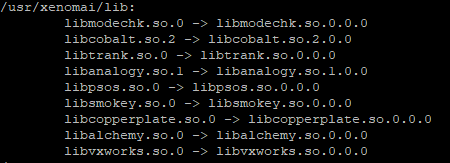

# [Documentation](https://source.denx.de/Xenomai/xenomai/-/wikis/Building_Applications_For_Xenomai_3)
## 1. Add xeno dynamic libraries path to dynamic linker

### 1.1 Change dir to dynamic linker config folder
```
 cd /etc/ld.so.conf.d
```

### 1.2 Create the file ``xeno.conf``
```
sudo nano xeno.conf
```
### 1.3 Add the following two lines and save the file
```bash
# xeno dynamic libs path
/usr/xenomai/lib/
```

### 1.4 Reboot the rPi
```bash
sudo reboot now
```

### 1.5 Run to check if the xeno libs bindings are availabe
```
 sudo ldconfig -v
```


