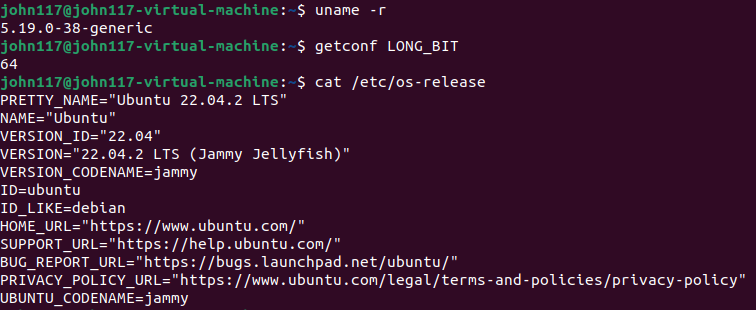

# 1. The Host

## HW
 - VM
 - WSL
 - Real HW 

## OS: 
 - Ubuntu 22.04.2 64 bit: [Download Link](https://releases.ubuntu.com/jammy/ubuntu-22.04.2-desktop-amd64.iso)

# 2. The Target
## HW:  
 - CM4 8GB RAM, 32GB EMMC, WiFi PN: [CM4108032](https://ro.farnell.com/raspberry-pi/cm4108032/rpi-computemodule-4-32gb-emmc/dp/3585683) 
 - CM4IO PN: [3563491](https://ro.farnell.com/raspberry-pi/cm4io/compute-module-4-board-arm-cortex/dp/3563491?MER=TARG-MER-PDP-RECO-STM71413)

- rPi4 

## OS:  
###  32bit
 - Raspbian Lite 32bit 2023-02-21: [Download Link](https://downloads.raspberrypi.org/raspios_lite_armhf/images/raspios_lite_armhf-2023-02-22/2023-02-21-raspios-bullseye-armhf-lite.img.xz)

### 64bit
 - Raspbian Lite 64bit 2023-02-21: [Download Link](https://downloads.raspberrypi.org/raspios_lite_arm64/images/raspios_lite_arm64-2023-02-22/2023-02-21-raspios-bullseye-arm64-lite.img.xz)

