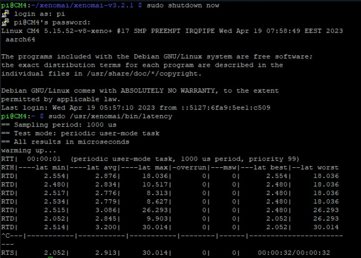

# The folowing steps are done on the target(rPi)
&nbsp;
&nbsp;
### 1. Download Xenomai v3.2.1
```
wget https://source.denx.de/Xenomai/xenomai/-/archive/v3.2.1/xenomai-v3.2.1.tar.bz2
```

### 2. Unzip xenomai
```
tar xjvf xenomai-v3.2.1.tar.bz2
```

### 3. Config and install xenomai
In case you missed Step 2 in Chapter 1
```
sudo apt-get install autoconf autogen libtool 
```
```
cd xenomai-v3.2.1
```

```
./scripts/bootstrap
```

```
./configure --with-core=cobalt --enable-smp
```

```
sudo make install
```

### 4. Some tweaks
```
sudo nano /boot/cmdline.txt
```
add to end of first line
```
dwc_otg.fiq_enable=0 dwc_otg.fiq_fsm_enable=0 dwc_otg.nak_holdoff=0 isolcpus=0,1 xenomai.supported_cpus=0x3
```

```
sudo nano /boot/config.txt
```
Add at the top
````
total_mem=3072
````

### 5. Test
Works as expected :)



### Documentation:
#### [Installing Xenomai 3](https://source.denx.de/Xenomai/xenomai/-/wikis/Installing_Xenomai_3)
