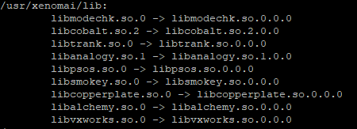
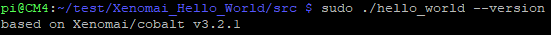

# The folowing steps are done on the target(rPi)
&nbsp;
&nbsp;
## 1. Add xeno dynamic libraries path to dynamic linker

### 1.1 Change dir to dynamic linker config folder
```
 cd /etc/ld.so.conf.d
```

### 1.2 Create the file ``xeno.conf``
```
sudo nano xeno.conf
```
### 1.3 Add the following two lines and save the file
```bash
# xeno dynamic libs path
/usr/xenomai/lib/
```

### 1.4 Reboot the rPi
```bash
sudo reboot now
```

### 1.5 Run to check if the xeno libs bindings are availabe
```
 sudo ldconfig -v
```



## 2. Build an App
### 2.1 Clone the example app
```bash
git clone https://github.com/George117/Xenomai_Hello_World
```

### 2.2 Change dir to ``src`` folder
```bash
cd Xenomai_Hello_World/src
```

### 2.3 Run the ``make`` command
```bash
make
```

### 2.4 Run the app
```
sudo ./hello_world
```
If everything went fine you should see the famous ``Hello world`` print.

### 2.5 Check if the xenomai bindings work
```
sudo ./hello_world --version
```

If everything worked out so far, you should see the xenomai/cobalt version printed.



Note:
Maybe you already saw the the source code for the [Hello World](https://github.com/George117/Xenomai_Hello_World/blob/main/src/hello_world.c) is just a ``printf``. The command line option ``version`` comes directly from the xenomai libs. Read the below documentation for details.

### Documentation:
#### [Building Applications For Xenomai 3](https://source.denx.de/Xenomai/xenomai/-/wikis/Building_Applications_For_Xenomai_3)
#### [App Setup And Init](https://source.denx.de/Xenomai/xenomai/-/wikis/App_Setup_And_Init)
