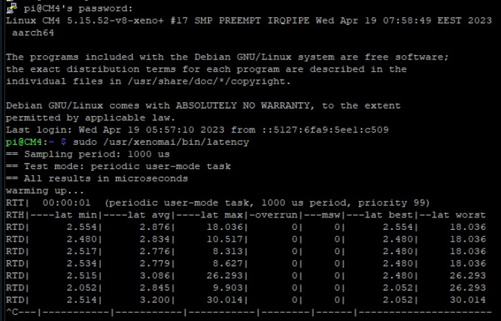

# Experience the glory of Xenomai on your rPi!
&nbsp;
&nbsp;
&nbsp;
# Table of contents
1. [A new beginning - Prerequisites](chapter_0.md)
2. [What about dependencies?](chapter_1.md)
3. [A manual affair - Patch the kernel with Cobalt](chapter_2.md)
4. [Are we there yet? Install Xenomai on rPi](chapter_3.md)
5. [Mandatory Hello World App](chapter_4.md)
&nbsp;
&nbsp;
These steps were tested on a Raspberry Pi Compute Module 4 starting from a Raspbian Lite 64bit distribution.

